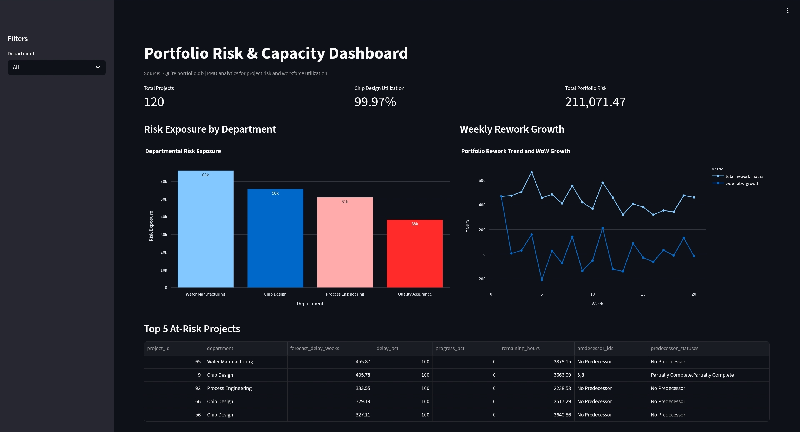

# 🚀 Enterprise Project Portfolio Risk & Analytics Simulator

> **Simulation + SQL Analytics + Streamlit Dashboard for Enterprise Project Portfolio Management**

## 📖 Project Overview
This project simulates an enterprise-scale engineering portfolio to analyze **project risk exposure, workforce capacity constraints, and operational disruptions** in complex R&D environments such as semiconductor or automotive industries. 

The system models **120 projects and 80 employees** and introduces realistic enterprise dynamics including:
- 👥 Resource capacity constraints
- 🔗 Project dependencies (DAG)
- ⚠️ Operational issues and rework
- 📉 Portfolio-level risk exposure

The goal is to demonstrate how **simulation, SQL analytics, and interactive dashboards** can be combined to monitor portfolio health and identify potential bottlenecks.

---

## 🖥️ Dashboard Preview
The Streamlit dashboard provides an overview of portfolio health, departmental risk exposure, and operational rework trends.



---

## 🛠️ Tech Stack

**⚙️ Simulation Engine**
- Python (Object-Oriented Programming)

**🗄️ Data Engineering**
- Pandas & NumPy
- SQLite

**🔍 Analytics**
- SQL (CTE queries)
- Window Functions (LAG, DENSE_RANK)

**📈 Visualization**
- Streamlit
- Plotly

---

## ✨ Key Features

### 🏢 Portfolio Simulation Engine
The simulation models a complex multi-project environment where:
- Employees have weekly capacity limits.
- Projects require varying workloads and durations.
- Operational issues generate additional rework.
- Project dependencies affect progress.

### 🕸️ Dependency-Aware Project Network
Projects can depend on other projects through a **Directed Acyclic Graph (DAG)** structure. This simulates real-world situations where certain projects cannot progress until upstream tasks are completed.

### ⏳ Workforce Capacity Modeling
Employee productivity includes:
- Weekly capacity limits.
- Multi-project context switching penalties (15%).
- Department-based project assignments.
*This allows the simulation to capture resource bottlenecks and utilization effects.*

### 🎲 Stochastic Operational Disruptions
Operational issues are generated using a **Poisson distribution**. These issues introduce additional rework hours and create unpredictable disruptions in project timelines.

### 📊 Risk Exposure Analytics (SQL)
The simulation outputs are stored in a **relational SQLite database** and analyzed using SQL. Key analytics include:
- Departmental risk exposure & Workforce utilization.
- Project delay forecasting & Dependency impact analysis.

### 📱 Interactive Portfolio Dashboard
The Streamlit dashboard allows users to explore:
- Portfolio risk exposure by department.
- Weekly rework growth trends.
- The most delayed projects in the portfolio.

---

## 🚀 How to Run

1. **Clone the repository:**
```bash
git clone [https://github.com/omaewamoushindei/enterprise-ppm-risk-simulator.git](https://github.com/omaewamoushindei/enterprise-ppm-risk-simulator.git)
```

2. **Install dependencies:**
```bash
pip install -r requirements.txt
```

3. **Run the dashboard:**
```bash
streamlit run app.py
```

---

## 💡 Example Insights
The analytics layer can reveal critical business insights such as:
- Which departments accumulate the highest risk exposure.
- How operational issues affect portfolio performance over time.
- Which projects are most likely to experience severe cascading delays.

---

## 📂 Project Structure
```text
enterprise-ppm-risk-simulator
│
├── data/
│   ├── enterprise_portfolio_results.csv
│   └── employee_capacity_audit.csv
│
├── images/
│   └── dashboard.png
│
├── app.py
├── portfolio.db
├── simulation.ipynb
├── requirements.txt
└── README.md
```

---

**🎯 Purpose:**
This project was created as a portfolio analytics demonstration to showcase how simulation, SQL analytics, and data visualization can be combined to analyze complex enterprise project portfolios.
